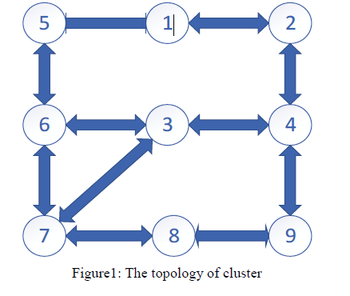
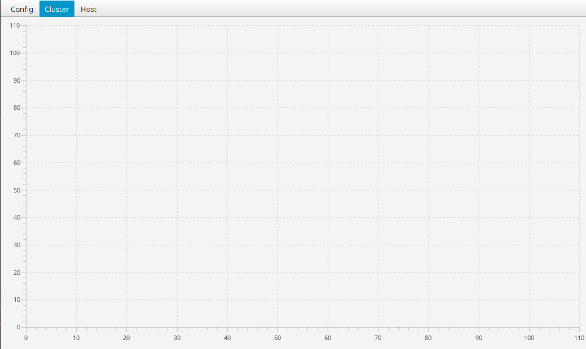
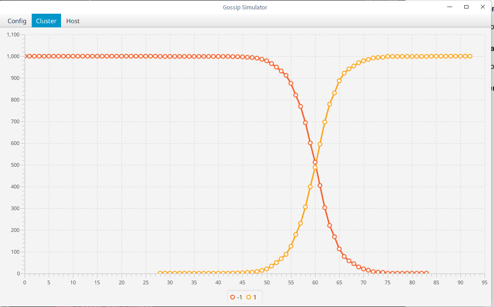

# This is illusory gossip developped by Wang Xiaosen,Hu Xueshi,Gong Haoyu,Wang Shuai.

# Multiple Thread Gossip

### Method
**RandomInteger class**, which is responsible for generate random integer between a determined range.
send/receive object, the former sends UDP message to other nodes while the later receives UDP message from other nodes.

**IfPortUsed class**, which assigns UDP ports and make sure that each port is unique.

**Node class**, which is regarded as a node and stores the version of message. It chooses a neighbor randomly to send its message per 0.5~1.5 sec by calling send and receive its neighbor’s message by calling receive. Then it compare the version of message it stores with the one it received from its neighbor just now to update to version, which means the node replace the message if the version of it is older than the one from other node.

**Seed class**, which executes every 8 seconds to select a node randomly and increment the version number of its message.

**PrintInfo class**, which prints the version of all the nodes per-sec.

### Implementation
We generate nine ports that are different from each other and then bind them to nine sockets which are assigned to nine nodes. Each node runs on a single thread which create two threads one sends UDP message to its neighbor and another is responsible for receive message and update its version to the higher one. Create a thread to run a seed object which select a node randomly per 8 seconds and update its message version.
### Analysis
Figure1 shows the topology of the cluster, which has nine nodes and eleven edges. Open the command window and run the executable jar file, Figure2 shows the results, as you can see, it updates the message version of one of the nodes and it spreads like epidemics to other nodes in the cluster.

# Gossip Simulator

### What is Gossip 
> A [gossip](https://www.wikiwand.com/en/Gossip_protocol#/overview) protocol is a procedure or process of computer-computer communication that is based on the way social networks disseminate information or how epidemics spread

### What we implemented !
1. Adding new message to the cluster.
2. The scale of cluster, the loss rate of udp, the sparsity of the graph are adjustable,
3. Destroying the hosts and repairing the hosts dynamically.
4. Adding more hosts to cluster dynamically

### How to simulate a large scale cluster
It's almost impossible to create thousands of threads and communicate by UDP, so we use a special way to make it.
1. Creating a class named *Host* and every host is a object of it. It has attributes as follow:  
    1. **Id**  distinguish one host form others
    2. **Friends** contains all the host it can reach
    3. **Crashed** is the state of host
    4. **Version** is the highest version of message the host have
    
by these attributes are not enough, because it can not sending message, as mentioned before, implementing sending message by threads and UDP is difficult to achieve, so we need another class to help the hosts with sending message.

2. Creating a class named *God*, it contains all the hosts, a message creator who collect the messages from the hosts, a message handler who helps the hosts with handing message. God also has the ability to adding new message to the cluster, randomly make some hosts crash down and repaired.

## How to use

### Line Chart
**x-Axis** : the epoch  
**y-Axis** : the number of hosts   
The line chart shows as cluster running, the numbers of hosts affected by different messages.

### Manipulate Cluster

#### Init
By **Init**, the cluster is created.
  
If the cluster is running or freezing, **Init** will clear all the data 
and is ready to run.

#### Add New Message
Adding a new Message to the cluster.  

  
You can add new messages before the cluster run or add new messages when the cluster is already running. The Different message has are showed with different color. Having finished initializing the cluster, all the hosts contains a message numbered -1.

#### Run 
Let the cluster run.
  
After **Init** or **Freeze** the cluster, **Run** is necessary to make cluster alive.

#### Freeze 
Freeze the cluster

#### Restart
**Init** and **Run** the cluster.

### Manipulate Hosts

#### Destroy Hosts
Make some hosts can not sending and receiving any message.
  
The input should be a number, if input is  negative or zero, the actions will be ignored, if the number exceed the alive hosts, all the hosts will be destroyed. It's not guaranteed that the graph is still strongly connected.

#### Revive Hosts
Revive already destroyed hosts.
  
The input should be a number, if input is  negative or zero, the actions will be ignored, if the number exceed the dead hosts, all the hosts will be alive.

#### Add Hosts
Add more hosts to the cluster
  
Added hosts will not change the sparsity of cluster.

### Configuration

#### Save
Save the present configuration to the file.
#### Load
Load the present configuration to the file.
#### Config
Create a new cluster
  
After press the Button *OK*, If the configuration pane disappear, then the input is legal, otherwise it's illegal.Empty input means use present parameter.

